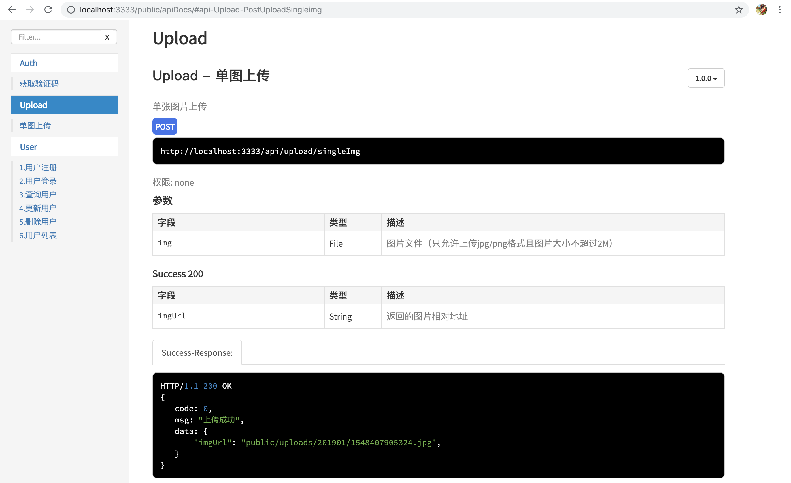
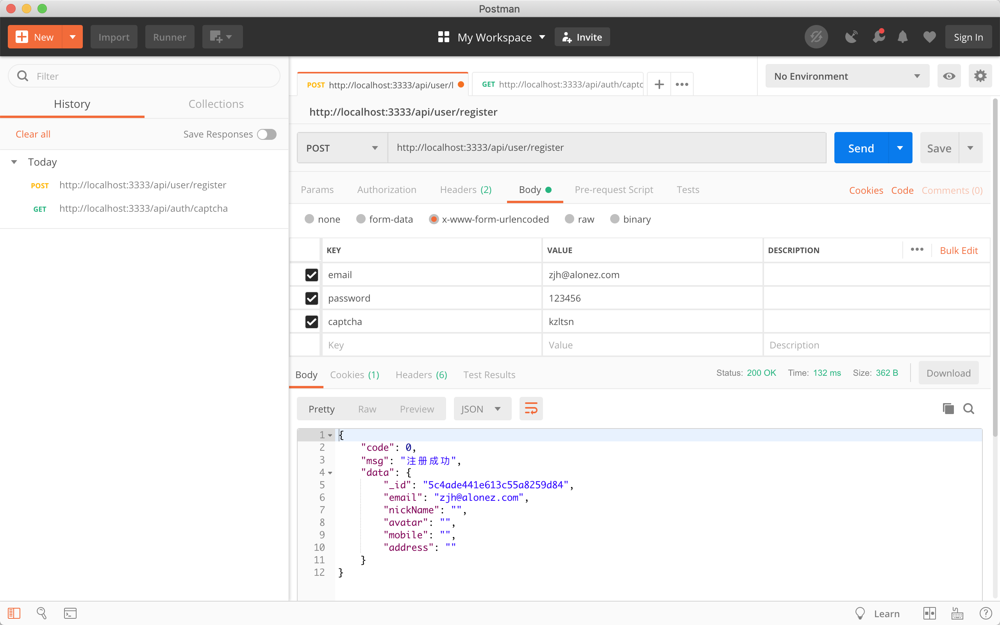

# restful-api
RESTful API with NodeJS, TypeScript, Express, MongoDB, JWT

## Screenshots

### Api Lists

#### apiDocs



#### user/register



## Project Setup

### Compiles for development with nodemon

``` bash
yarn start
```

### Lints files

``` bash
yarn lint
```

### Compiles for development

``` bash
yarn serve
```

### Compiles for production

``` bash
yarn bulid
```
## Extral Command

### Generate apidoc

``` bash
yarn apidoc
```

### Git commit

``` bash
yarn commit
```
